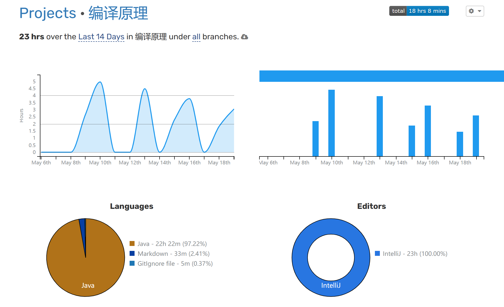
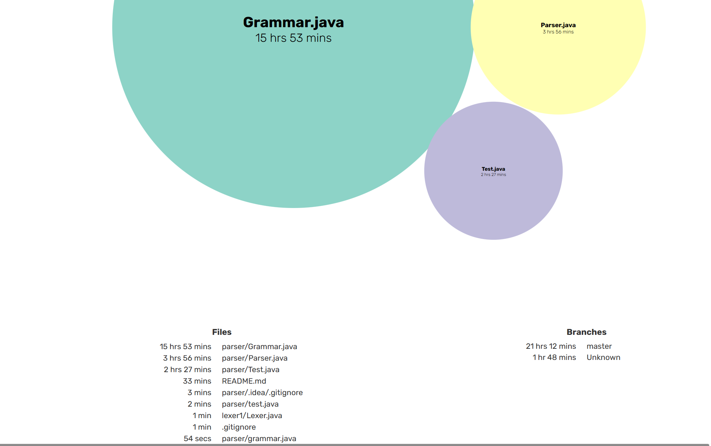

# 编译原理实验  [](https://wakatime.com/badge/user/b06f1799-d59e-4d93-be43-644d6ec7f0fc/project/f3d92d3c-d791-456f-b169-2cdc68996234)
## lab1 设计词法分析器
> 词法分析器要求<br>
    关键字: int, if, for<br>
    标识符: 字母(字母|数字)*<br>
    无符号数：包括科学计数法，浮点数，整数<br>
    运算符或分界符：=, *, +, ++, =, {, },<br>

```
源码在package lexer1中
```

## lab2 设计非递归的语法分析器
> 求解算法步骤:<br>
> - [x] 1.消除左递归(包括直接左递归和间接左递归)<br> 
> - [x] 2.求所有非终结符的First集<br> 
> - [x] 3.求所有非终结符的Follow集<br>
> - [x] 4.求所有候选式的Select集  
> - [x] 5.构建分析表  
> - [x] 6.构建分析栈  

```
源码在package parser中
```

# *This project needs patience to tackle some challenge, and very worthy.*
These pictures show the time that I spent in this project. Recording by Wakatime

